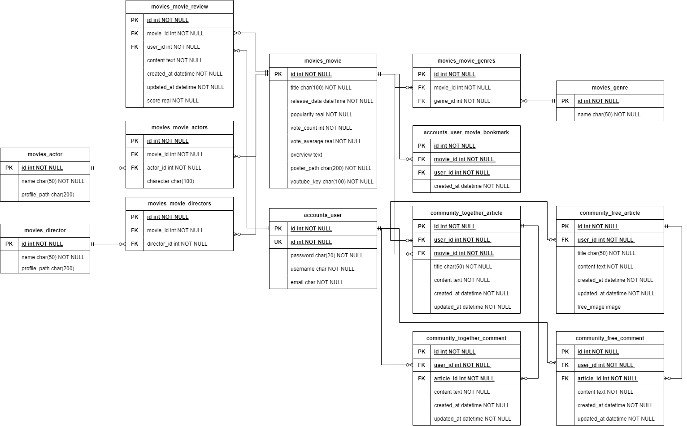

# Final project
 

# 📣 프로젝트 소개

다양한 상황에서의 영화 추천 시스템 제작을 목표로 함.   
혼밥을 하는 사람, 친구, 가족, 연인과 함께인 상황에서 영화를 더 빠르게 고를 수 있게 도와주는 서비스를 만들고자 함.

또한 다양한 추천 시스템(상황 별 추천, 랜덤 추천, 일반적인 인기순, 평점순, 장르 별 등)을 통해 사용자는 더 많은 추천을 받을 수 있도록 함.   

커뮤니티에서 영화 같이봐요 게시판을 만들어 사용자들이 영화 정보와 함께 소통을 할 수 있도록 하는게 목표

  

# 🙋‍♀️담당

| 이름  | 담당                                              |
| --- | ----------------------------------------------- |
| 이수연 | 팀장, 프론트(40%) / 백(60%) / 다영이 응원, 힐링, 정신 붙잡아주기 담당 |
| 선다영 | 프론트(60%) / 백(40%) / 수연이 응원, 힐링, 정신 붙잡아주기 담당     |

  

# 🔑데이터베이스 모델링 (ERD)

  

# 💻진행 과정

| 날짜   | 구현                                                                                            |          보완                                                                                                                              |
| ---- |---------------------------------------------------------------------------------------------| ------------------------------------------------------------------------------------------------------------------------------- |
| 0517 | - 시나리오 점검 및 컨셉 확정 - ERD 완성 - 시스템 UI 구조 완료                                             | - 컴포넌트 구조 - 와이어 프레임                                                                                                  |
| 0518 | - DB에 데이터 구성해놓기 - Random 페이지 구성  - 일반 영화 추천 페이지 구조 완성 - models.py 구성 완료           | - 컴포넌트 구조  - serializers 정의                                                                                                 |
| 0519 | - MovieDetailView 제작 - Serializer 완성                                     | - 다른 기능 없이 영화 정보만 나오는 것 보완하기 - event 정리                                                                                     |
| 0520 | - UI 스타일가이드 정리 - login, signup 등 account관련 완성 - 404페이지 제작                             | - 로그인 정보의 유무에 따른 페이지 제한 기능                                                                                                      |
| 0521 | - community: 자유게시판 게시글 작성, 조회  - community: 영화 같이봐요 페이지 구성, 자유게시판처럼 우선 글작성과 조회는 가능하도록 함   | - 댓글기능 구현해야함 - 작성자만 수정/삭제가 가능하도록 - 영화 같이봐요 페이지에서의 영화 검색 기능                                                              |
| 0522 | - community: 영화 검색 기능을 포함한 게시판 제작 - 모든 community에서 작성자만 게시글을 수정, 삭제 가능                    | - 검색은 가능하지만 게시글 detail에서는 영화 정보를 정상적으로 불러오지 못함                                                                              |
| 0523 | - 영화검색 community에서의 영화정보를 포함한 게시글 Detail 표시 - 영화 review 기능 - community 게시판에서 댓글 기능 구현 | - 모든 영화에 모든 리뷰가 나온다는 점 - 작성자만 댓글을 수정, 삭제 할 수 있도록                                                                            |
| 0524 | - 특정 영화에 작성한 리뷰만 보이게 수정 - user 프로필 페이지 제작 - 작성자만 댓글을 수정 삭제 가능 - 좋아요 버튼 토글    | - 프로필은 기본적인 정보만 담아오기 때문에 유저가 쓴 글과 좋아요한 영화 정보, 리뷰 등을 가져와야 함 - 버튼이 토글 되고 isLiked가 true, false 되는 것은 확인했지만 user의 정보가 저장이 되지 않음 |
| 0525 | - 좋아요 기능 => 프로필에서 좋아요 한 영화들 모아보기 가능 - 프로필 페이지 내에서 유저의 게시글, 리뷰, 좋아요한 영화 정볼보여줌  - CSS 마무리                                             |                                                                                                                                 |

  

# 🎬영화 추천 알고리즘
- 다양한 영화 추천 서비스를 목표
## 1. 상황 별 영화추천 서비스
- < 친구들 => 액션 범죄 스릴러 SF   
혼자 = > 드라마 미스터리 판타지 코미디   
연인 => 로맨스 공포 음악 코미디   
가족 = > 애니메이션 가족 드라마 모험 >  
이런식으로 상황별로 추천할 수 있도록 장르를 보통 자주 보는 장르로 일반화 시켰음.   
사용자가 어느 상황인지 선택을 하면 해당 장르가 포함 된 영화를 랜덤으로 추천해줌.
## 2. 랜덤 영화 추천 서비스
- 다양한 영화 중 정말 랜덤으로 영화 한 가지를 뽑아 추천해주도록 하는 서비스
## 3. 일반적인 영화 추천 서비스
- 장르별, 인기순, 평점순으로 정렬해 사용자가 선택할 수 있도록 함

  

# 👍서비스 대표 기능
## 1. Community 같이봐요 게시판
- 커뮤니티 페이지에서 자유게시판과 같이 봐요 페이지를 분리
- 자유게시판은 사용자들이 정말 자유롭게 글을 작성하고, 댓글을 달 수 있도록 구현
- 같이봐요 게시판은 영화 데이터 검색을 통해 영화를 선택을 하고 글을 작성하여 게시글 안에 영화 정보와 함께 사용자들끼리 소통을 할 수 있음

## 2. 다양한 추천 서비스
- 사용자가 누구와 함께 하는지에 따른 상황별 영화 추천 서비스
- 특정 장르를 포함하는 추천이 아닌 정말 랜덤으로 추천해주는 서비스
- 인기순, 평점순, 장르별 영화 추천 서비스

  

# 🤟기타 (느낀점, 후기)

## 🐯이수연
우선 팀장을 하고 프로젝트를 진행하는게 살짝 부담이 됐다. 하지만 다영이가 열정이 넘치고 항상 노력을 하는 친구여서 그런지 나도 함께 더 열심히 할 수 있었다.   
마지막 관통프로젝트라 지금까지 배운 내용들을 활용하면 수월하게 프로젝트를 완성할 수 있을 줄 알았는데, 아무것도 없는 상태에서 서비스를 기획, 설계하고 구현하는 게 정말 어려웠다.  
프로젝트를 진행하며 지금까지 배웠던 vue, django의 흐름이 눈에 보이기 시작했고, 시간이 갈수록 초반에 이해를 잘 못해 코드를 복잡하게 작성하고, chatGPT의 도움을 받은게 오히려 코드의 오류를 찾고 수정하기가 더 어려워졌다는 것을 느끼고 많은 아쉬움을 느꼈다.   
그래도 프로젝트의 후반부에서 구현하게 될 줄 몰랐던 좋아요 기능을 구현할 수 있게 되어서 정말 뿌듯했고, 프로필 페이지도 다양한 내용으로 구성할 수 있었다.    
이제 1학기를 마무리 하고 2학기부터는 다양한 프로젝트를 팀원들과 함께 진행하게 될텐데 미리 경험해 본 것 같아 좋았고, 2학기가 되면 더 열심히 해야겠다는 생각을 했다.
## 🐱선다영
하루 안에 모든 것을 끝냈던 관통 프로젝트와 다르게 일주일이 넘는 기간 동안 페어로 진행되는 프로젝트를 경험하며 많은 것을 배웠다.
수업 시간에 듣고, 시험을 봤던 것과 실제로 적용하는 것은 정말 다르고 스스로 부족한 점이 많다는 것을 느꼈다. 프로젝트가 끝났지만, 이대로 이 결과물을 끝내는 것이 아니라 앞으로 계속 발전시켜 나가야겠다고 생각했다.
그리고 팀장이자 페어인 수연이에게 배운 점이 너무 많다. 정말 열정적으로, 포기하지 않고 노력하는 것을 보며 더 열심히 임할 수 있었다. 프로젝트가 끝나가면서 다음에 프로젝트를 진행할 때는 미리 해둬야겠다고 생각한 것들, 아쉬웠던 점이 많았다. 아쉬웠던 점을 앞으로 계속해서 발전시켜나가야겠다.